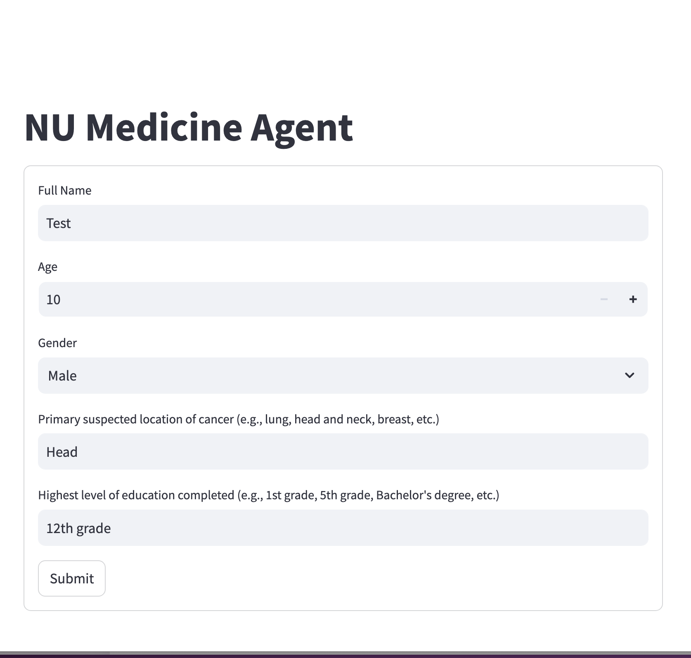

# CancerRAG : A RAG-Based LLM for Radiation Oncology Patient Queries


## **Introduction**

The proposed project seeks to bridge the communication gap between patients and clinicians in the field of radiation oncology by developing an advanced **Retrieval-Augmented Generation (RAG)-based Large Language Model (LLM)**. Cancer treatment is inherently complex, involving multifaceted medical, emotional, and logistical considerations. Patients often find it challenging to retain and process the extensive information provided during consultations, particularly regarding sensitive topics such as body image, mental health, and emotional well-being. These challenges can lead to misunderstandings, anxiety, and diminished satisfaction with care.

To address this critical issue, the project will design and implement an **AI-powered chatbot** specifically tailored for radiation oncology. This chatbot will leverage cutting-edge RAG techniques and domain-specific LLMs to deliver responses that are not only factually accurate but also empathetic and contextually aware. By integrating reliable medical knowledge with a conversational interface, the solution aims to:
  
1. **Enhance Patient Understanding**: Provide clear and concise explanations of treatment plans, side effects, and post-treatment care.  
2. **Support Emotional Well-being**: Address sensitive topics with empathy, offering reassurance and resources to help patients cope with their journey.  
3. **Improve Accessibility**: Enable patients to revisit information or seek clarification at their convenience, reducing dependence on clinicians for follow-up queries.  
4. **Streamline Communication**: Allow clinicians to focus on advanced medical tasks by offloading routine inquiries to an intelligent, automated system.  
5. **Build Trust**: Ensure responses are grounded in authoritative sources and medical guidelines, fostering confidence among patients.

By improving the accessibility, clarity, and quality of patient communication, this project aspires to enhance overall patient satisfaction and contribute to better health outcomes in the oncology domain.

## **Table of Contents**

1. [Introduction](#introduction)
2. [Pipeline Architecture](#pipeline-of-rag-deployment)
3. [Installation](#installation)
2. [Features](#features)
3. [Components](#components)
   - [WebScraping](#webscrapping)
   - [Backend](#backend)
   - [Frontend](#frontend)
4. [Examples](#examples)
5. [Contributors](#contributors)
---

## **Pipeline of RAG Deployment**


## **Installation**

To set up the project, ensure access to a GPU machine equipped with a GPU card offering at least 50GB of memory. This project requires running **Llama3.1:8b** and **Llama3.1:70b** models using the **Ollama Server**. For detailed installation and setup instructions, refer to the comprehensive [installation guide](docs/server-installation.md).

### Step 1: Repository Setup

1. **Clone the Repository**  
   Begin by cloning the CancerRAG Git repository to the server:
   ```bash
   git clone https://github.com/ayush9818/CancerRAG
   cd CancerRAG
   git checkout master
   ```

2. **Environment Configuration**  
    - Create an `.env` file in the root directory from env_template to manage environment variables. This will hold sensitive information like database credentials, API keys, and configuration settings.

        ```bash
        cp env_template .env 
        ```
    - Fill the required environment variables in .env file
        ```bash
        POSTGRES_USER=<POSTGRES_USERNAME>
        POSTGRES_PASSWORD=<POSTGRES_PASSWORD>
        POSTGRES_DB=<POSTGRES_DB_NAME>
        INIT_MODE=<DB_INIT_FLAG> 
        ```
    - Environment Variables description
        
        1. POSTGRES_USER : Username to connect to database. Can be set to any name. Eg. **nu_troy**
        2. POSTGRES_PASSWORD : Password to connect to database. Eg. **password**
        3. POSTGRES_DB : Name of the dabase. Eg. **cancer_rag_db**
        4. INIT_MODE : There are two steps to setup. First step is the database initialization step, in that case this variable is set to 1, otherwise set to 0 for conversational tasks.


### Step 2: Docker Builds

This section covers building the Docker images for both the backend and frontend services of the CancerRAG application.

1. **Build Backend Service**  
   - Navigate to the backend service directory and build the Docker image.
     ```bash
     cd backend
     docker build -f Dockerfile -t cancer_rag_backend .
     ```

2. **Build Frontend Service**  
   - Navigate to the frontend service directory and build the Docker image. 
     ```bash
     cd frontend
     docker build -f Dockerfile -t cancer_rag_frontend .
     ```

### Step 3: Database Initialization

**Note** : If you have already setup the things once, and want to setup again by reseting everything, make sure you run the following commands to reset properly
```bash
docker volume rm -f cancerrag_postgres_data
docker volume prune
```

To set up the initial database and schema, follow these steps:

1. **Enable Initialization Mode**  
   - Locate the `.env` file in the project root directory.
   - Find the `INIT_MODE` flag and set it to `1` to enable initialization mode:
     ```plaintext
     INIT_MODE=1
     ```
   - This flag ensures that the application runs the database setup process.

2. **Run the Initialization Command**  
   - From the project root directory, execute the following command to create the database and initialize the schema:
     ```bash
     docker compose -f docker-compose-init.yml up -d
     ```
   - This command launches the services defined in `docker-compose-init.yml`, which is specifically configured for initializing the database. The `-d` flag allows the services to run in the background.
   
3. **Verify Initialization**  
   - Check the logs to confirm the schema has been created successfully. You can view the logs with:
     ```bash
     docker logs <container_name>
     ```
   - Replace `<container_name>` with the name of the container responsible for initialization.

4. **Disable Initialization Mode**  
   - Once the database schema has been successfully initialized, return to the `.env` file and set the `INIT_MODE` flag back to `0` to prevent re-running the initialization on subsequent startups.

5. **Run the data ingestion script**

    In this step, you will load initial data into the database, preparing it for retrieval in the RAG pipeline. Follow these instructions to install dependencies and run the ingestion script with your data file.

    a. **Install Required Python Libraries**  
    Ensure you have the necessary Python libraries installed by running:

    ```bash
    pip3 install requests pandas
    ```

    b. **Run the Data Ingestion Script**  
    With the dependencies installed, use the following command to run the data ingestion script and load the initial data into the database:

    ```bash
    python3 scripts/data_ingestion_api.py \
        --data-path data/data_files/capstone_final_data_v1.csv \
        --api-base-url http://localhost:8000
    ```

    - **`--data-path`**: Specify the path to your initial data file (in CSV format) containing the questions and answers.
    - **`--api-base-url`**: Set the base URL for the API server. Make sure the server is running and accessible at this address (e.g., `http://localhost:8000`).

    This command will process the data in batches, sending each entry to the database through the API, enabling it to be ready for efficient retrieval in your RAG pipeline.

### Step 4: Launching Chatbot


With the data successfully loaded into the database, the next step is to launch the chatbot service. This service will use the preloaded data to provide responses within the RAG pipeline. Follow these instructions to configure and start the chatbot:

1. **Disable Initialization Mode**  
   - Open the `.env` file in the project root directory.
   - Set the `INIT_MODE` flag to `0` to prevent reinitialization of the database:
     ```plaintext
     INIT_MODE=0
     ```
   - This ensures that the chatbot service runs in normal mode without re-ingesting data.

2. **Start the Chatbot Service**  
   - From the project root directory, use the following command to launch the chatbot service in detached mode:
     ```bash
     docker compose -f docker-compose.yml up -d
     ```

   - The `-d` flag runs the service in the background, allowing the chatbot to operate independently.

3. **Verify Service Status**  
   - Check that the chatbot service is running by viewing active containers:
     ```bash
     docker ps
     ```
4. **Access the Chatbot**
    - Once the service is running, the chatbot will be accessible at http://localhost:8501.
    - Open this URL in your web browser to interact with the chatbot.

Once the chatbot service is up, it will be ready to interact with users, retrieving relevant information from the database and providing responses based on the data in the RAG pipeline.


## **Features**

1: **Personalized Responses**: Provides personalized, accurate, and empathetic answers tailored to patient questions using user demographics and medical context.

2: **Expanded Knowledge Base**: Enhanced RAG database with over 500 QA pairs, ensuring depth and comprehensiveness in medical query handling.

3: **Dynamic Retrieval Pipeline**: Implements Facebook AI Similarity Search for high-performance embedding-based similarity searches, improving retrieval accuracy.

4: **LLM-Driven Response Generation**: Powered by the LLaMA3.1 8B model, enabling context-aware and nuanced responses for complex patient inquiries.

5: **Grading and Evaluation**: Utilizes LangChain Grader Chain to assess and improve the accuracy and relevance of generated responses.

6: **Data Management System**: Efficiently stores user queries, generated responses, evaluations, and vector embeddings for streamlined data operations.

7: **Empathetic Conversational Design**: Features conversational flows fine-tuned for addressing sensitive medical topics with empathy and care.

8: **Multi-Level Retrieval Systems**: Combines hierarchical retrieval techniques to fetch precise and contextually relevant data from domain-specific knowledge bases.

## **Components**

### **Webscrapping**

Question-and-answer resources were meticulously collected and analyzed from the official websites of four prominent oncology and radiation oncology organizations: RadiologyInfo.org (sponsored by RSNA and ACR), RTAnswers.org (ASTRO), Cancer.gov (NCI at NIH), and Cancer.net (ASCO). These websites are recognized for providing authoritative and comprehensive information on various oncology and radiation oncology topics. To equip the chatbot with reliable and trusted medical knowledge, a web scraping process was employed to extract relevant Q&A pairs from these reputable sources, ensuring accuracy and context-specific responses.

Using the BeautifulSoup library in Python, the HTML content of the targeted web pages was parsed to identify and extract the main sections containing pertinent information. The extraction process focused on headers such as `<h2>`, `<h3>`, and `<h4>` tags, which typically represented questions, while the corresponding answers were retrieved from associated `<p>` tags (paragraphs) or list items within `<ul>` and `<li>` tags. This automated and systematic approach yielded a dataset of over 500 Q&A pairs, encompassing a diverse range of topics in cancer radiation therapy, including external beam radiation, brachytherapy, systemic radiation, photodynamic therapy, and various safety considerations.

The Python script and Jupyter Notebook used to perform this data collection are available in the [web-scrapers folder](web-scrappers), enabling easy replication or further customization for related projects. This curated dataset serves as a valuable resource for developing applications such as AI-driven chatbots or educational tools tailored to the medical field, ensuring that users have access to high-quality, evidence-based information.

**Reference Website Links**
- www.cancer.org/cancer/managing-cancer/treatment-types/radiation/
- www.cancer.gov/publications/patient-education/radiation-therapy-and-you
- www.cancer.org/cancer/understanding-cancer.html
- www.cancer.org/cancer/types/breast-cancer/about.html
- www.cancer.org/cancer/types/colon-rectal-cancer/about/what-is-colorectal-cancer.html
- www.cancer.org/cancer/types/lung-cancer/about/what-is.html

## **Backend**
  
The backend supports a robust **Retrieval-Augmented Generation (RAG) model** designed to power an AI-driven chatbot for radiation oncology treatment. It integrates **AI development tools**, **configuration settings**, **database models**, and **API routers** to deliver personalized, accurate, and user-friendly responses to cancer-related queries.

---

### **Key Features**
1. **Knowledge Management**:  
   - Dynamic retrieval of relevant Q&A pairs using vector similarity search.  
   - Automatic updates to the chatbot's knowledge base based on user inputs.

2. **Query Handling**:  
   - Processes cancer-related queries with contextual relevance.  
   - Leverages LLM prompts and evaluation chains for detailed response generation.

3. **Session and Data Management**:  
   - Tracks user sessions and chat interactions.  
   - Stores session-level and chat-level analytics in a structured database.

4. **Evaluation and Grading**:  
   - Implements a grading system to rank retrieved documents and responses for relevance and fluency.

---

### **Folder Structure**

#### 1. `ai`
Core logic for the RAG model.  
- **[prompts.py](backend/cancer_rag/ai/prompts.py)**: Templates for chatbot prompts, including knowledge updates and grading.  
- **[models.py](backend/cancer_rag/ai/models.py)**: Pydantic data structures for user queries, responses, and relevance scoring.  
- **[llms.py](backend/cancer_rag/ai/llms.py)**: Classes for LLM configuration and API integrations via `langchain_ollama`.  
- **[chains.py](backend/cancer_rag/ai/chains.py)**: Modular chains for knowledge extraction, conversations, and evaluation.  
- **[retriever.py](backend/cancer_rag/ai/retriever.py)**: Vector-based retrieval using FAISS, with text normalization and similarity thresholds.

#### 2. `configs`
Configuration files for customizing model parameters and logic.  
- **[config.yaml](backend/cancer_rag/configs/config.yaml)**: Specifies settings like embedding models, retrieval logic, and evaluation chains.  

```yaml
normalize_embeddings: False
similarity_top_k: 3
similarity_threshold: 0.4
model: llama3.1:70b
conversation_chain: llama3.1:8b
grader_chain: llama3.1:8b
evaluation_chain: llama3.1:8b
```

#### 3. `models`
Manages database interactions and schema definitions.  
- **[database.py](backend/cancer_rag/models/database.py)**:  
   - Defines database schemas using SQLAlchemy for session and chat data.  
   - Implements `Session` and `SessionChat` tables with relationships to manage chat logs efficiently.  
- **[schema.py](backend/cancer_rag/models/schema.py)**:  
   - Pydantic models for structuring and validating session and chat data.  

#### 4. `routers`
Defines API endpoints using FastAPI.  
- **[session_chat_router.py](backend/cancer_rag/routers/session_chat_router.py)**:  
   - **POST `/sessions/chats/`**: Add chat entries to a session.  
   - **GET `/sessions/chats/`**: Retrieve chat history for a session.  
- **[session_router.py](backend/cancer_rag/routers/session_router.py)**:  
   - **POST `/sessions/`**: Create a new session.  
   - **GET `/sessions/`**: List all sessions.

#### 5. `utils.py`
Utility functions for text preprocessing and database integration.

#### 6. `envs.py`
Manages environment variables using dotenv, centralizing configurations like database URIs and LLM endpoints.

#### 7. `curd.py`
Simplifies database operations with abstracted SQL queries for session and chat management.

### 8. `app.py`
Entry point for running the chatbot API using FastAPI and Uvicorn. Serves endpoints for query handling and session management.

---


## **Frontend**

The frontend provides an intuitive web interface for users to interact with the chatbot, visualize data, and view predictions.


### **Key Features**
1. **User Interaction**: Collects user information and handles chat interactions with the AI-powered chatbot.  
2. **Dynamic Knowledge Retrieval**: Processes user queries and retrieves relevant information for response generation.  
3. **Evaluation and Analytics**: Scores chatbot responses for accuracy and relevance and performs text analytics for deeper insights.  
4. **Session Management**: Tracks and stores session-level and chat-level data for personalized interactions.  
5. **Streamlit Interface**: Offers an interactive, user-friendly web interface for seamless communication.

---

### **Folder Structure**

#### 1. `frontend/chat_app`
- **[api_handler.py](frontend/chat_app/api_handler.py)**:  
  Provides an `APIHandler` utility for handling GET and POST requests with retry logic and exponential backoff.  
  - Handles API requests with robust error handling and retry mechanisms.  
  - Ensures reliable communication with backend APIs.

- **[app.py](frontend/chat_app/app.py)**:  
  Implements the chatbot interface using Streamlit.  
  - Collects user details and initializes backend sessions.  
  - Processes chat interactions using backend APIs for conversational and knowledge chains.  
  - Integrates evaluation chains for response scoring and stores chat analytics.  

- **[envs.py](frontend/chat_app/envs.py)**:  
  Manages environment variables and constructs API URLs dynamically.  
  - Loads critical settings like `BASE_URL` and `TEST_MODE`.  
  - Maps API endpoints for retrieval, conversational chains, and evaluation.  

- **[models.py](frontend/chat_app/models.py)**:  
  Defines Pydantic models for managing user data and evaluation results.  
  - `KnowledgeBase`: Stores user information and conversational context.  
  - `GradeDocuments`: Evaluates the relevance of retrieved documents.  

- **[utils.py](frontend/chat_app/utils.py)**:  
  Provides utility functions for session management, API calls, and analytics.  
  - Creates user sessions and logs chat interactions.  
  - Performs text analytics on chatbot responses for readability and sentiment.  

----

## Examples



# Contributors
- Ayush Agarwal
- Grace Xie
- Jiayu Hu
- Seth Kazarian
 
